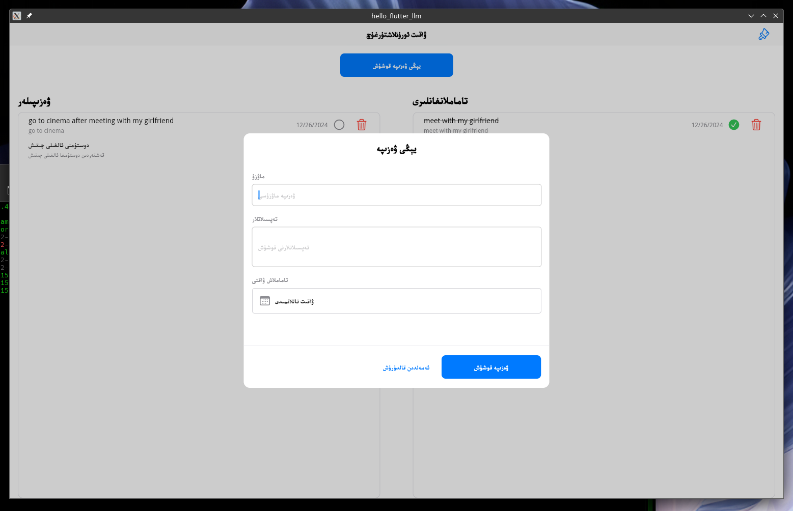
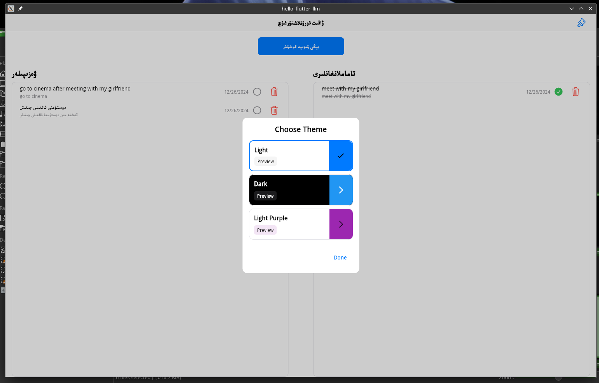
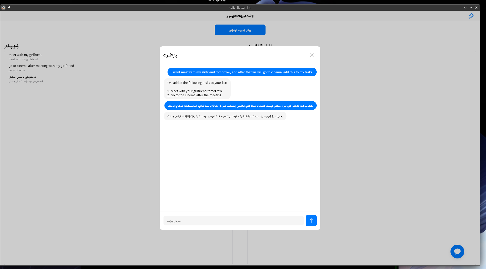
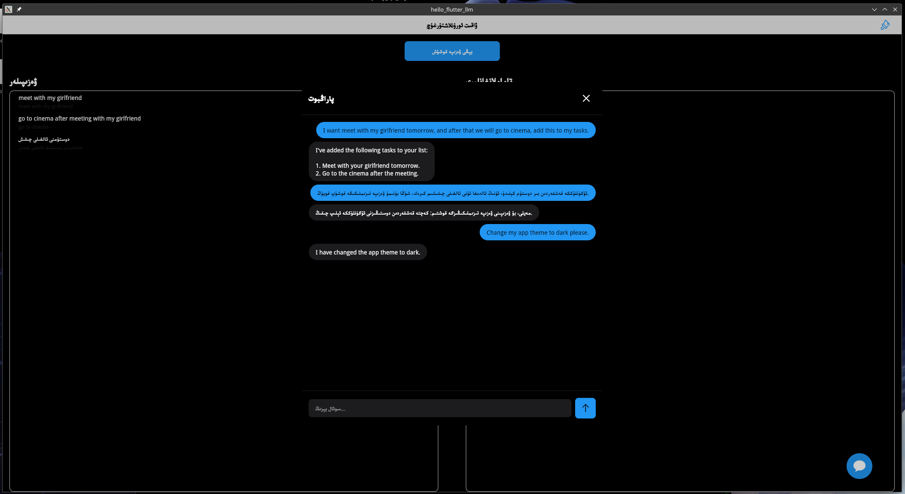
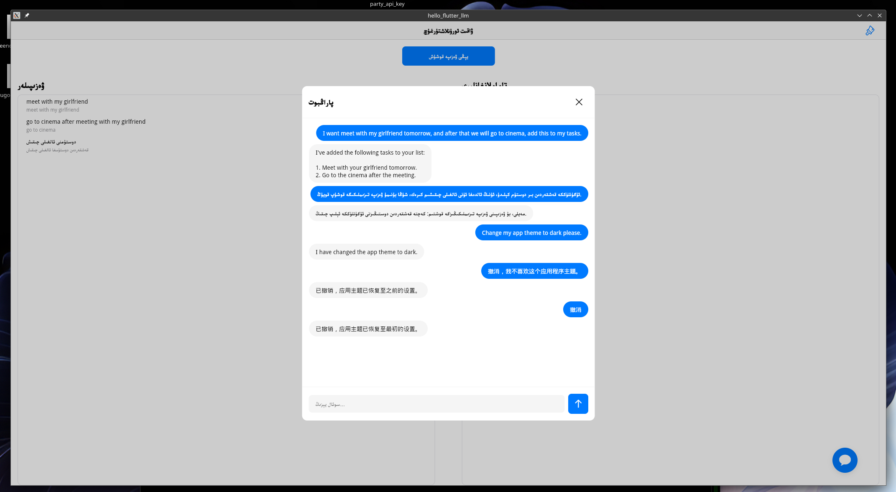
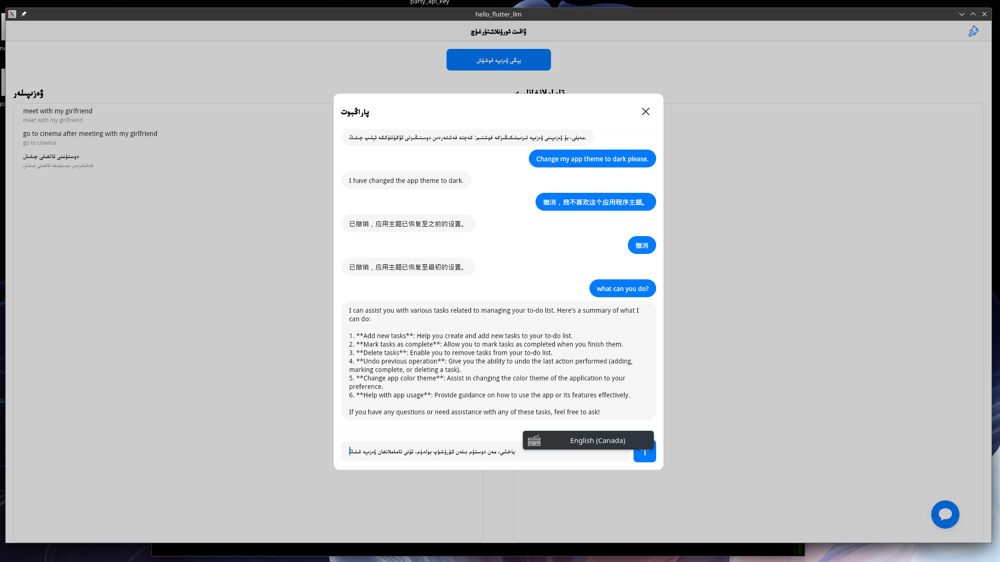
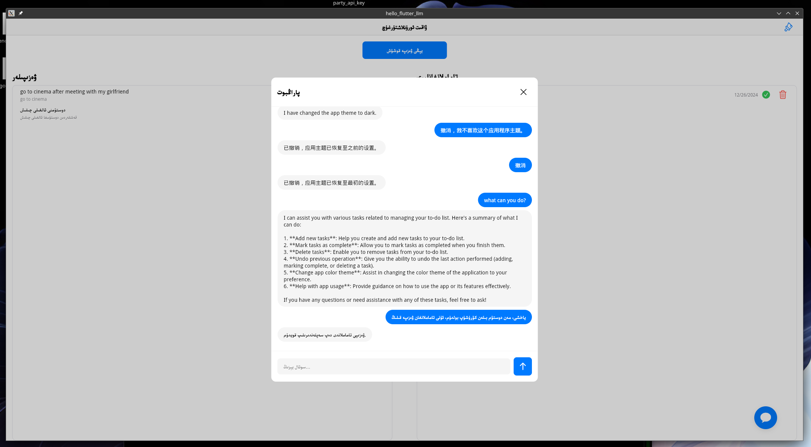

# Thanks to Cursor, 90% of code is written by Cursor.

# What is this?

This is a very simple TODO app written in flutter.

# Why?

There are a lot of developers working with traditional development techniques like frontend, backend, database, game etc. purpose of this project is to help them to understand and how to integrate Large language models to build their own apps to bring more value to their customers.

# How?

## How it works?
This is just a simple app that allows you to add, remove, and edit TODO items, and what is more than that, it uses OpenAI API to convert user natutal language to commands to manage TODO items.

in this case users can operate the app by natural language.

## lets try say something like this:

```
I want to meet with John at 10am tomorrow and we will go to the coffee shop
```

```
I don't like current app theme, change it to dark.
```

or you can undo the operation by saying:

```
undo
```

you can also say in Chinese or any language your LLM supports:

```
مەن ئەتە قىز دوستۇم دىگەن توخۇ پوقى بىلەن ئۇرۇشماقچى، شۇڭا بۇنى ۋەزىپە قىلىپ قويسىڭىز.
```

## How to use?

1. Clone the repository
2. Run the app with `flutter run`
3. Use natural language to manage TODO items like "I want to meet with John at 10am tomorrow and we will go to the coffee shop"

## OpenAI API Key?

I use kimi for this project, it is a OpenAI api compatible LLM service provider in China. technically you can use any other OpenAI api compatible LLM service provider.

for easy to use, I embed my kimi api key in the code, you can change it to your own api key. **(BUT PLEASE DON'T MISUSE MY API KEY)**

# Screenshots









